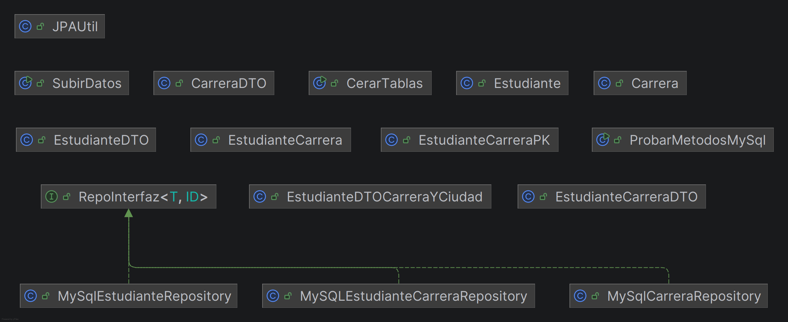
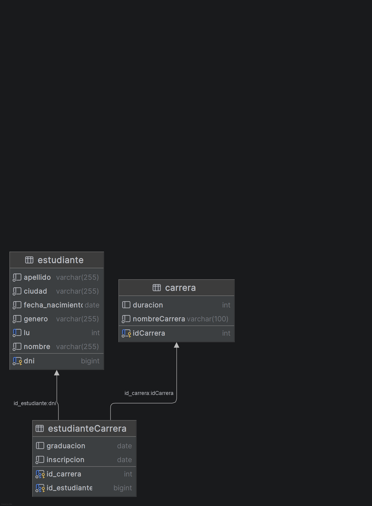

# ArquitecturasWeb Grupo 5

## Integrador - Parte 2

Aplicación Java para administrar estudiantes, carreras e inscripciones, utilizando JPA/Hibernate y MySQL.

### Diagrama de entidades de la base de datos

El archivo `img_2.png` contiene el diagrama de tablas y sus relaciones: `estudiante`, `carrera` y `estudianteCarrera`.

### Diagrama de clases

El archivo `img.png` contiene una vista general de las clases. El siguiente diagrama Mermaid detalla sus atributos, constructores y métodos implementados.

```mermaid
classDiagram
    class Carrera {
        -int idCarrera
        -String nombreCarrera
        -int duracion
        +Carrera()
        +Carrera(int idCarrera, String nombreCarrera, int duracion)
        +getIdCarrera() int
        +setIdCarrera(int idCarrera) void
        +getNombreCarrera() String
        +setNombreCarrera(String nombreCarrera) void
        +getDuracion() int
        +setDuracion(int duracion) void
        +toString() String
    }

    class Estudiante {
        -Long dni
        -String nombre
        -String apellido
        -String genero
        -String ciudad
        -int lu
        -LocalDate fechaNacimiento
        +Estudiante()
        +Estudiante(Long dni, String nombre, String apellido, int edadCsv, String genero, String ciudad, int lu)
        +Estudiante(Long dni, String nombre, String apellido, String genero, String ciudad, int lu, LocalDate fechaNacimiento)
        +getDni() Long
        +setDni(Long dni) void
        +getNombre() String
        +setNombre(String nombre) void
        +getApellido() String
        +setApellido(String apellido) void
        +getGenero() String
        +setGenero(String genero) void
        +getCiudad() String
        +setCiudad(String ciudad) void
        +getLu() int
        +setLu(int lu) void
        +getFechaNacimiento() LocalDate
        +setFechaNacimiento(LocalDate fechaNacimiento) void
        +getEdad() int
    }

    class EstudianteCarrera {
        -EstudianteCarreraPK id
        -Estudiante estudiante
        -Carrera carrera
        -LocalDate inscripcion
        -LocalDate graduacion
        +EstudianteCarrera()
        +EstudianteCarrera(EstudianteCarreraPK id, Estudiante estudiante, Carrera carrera, LocalDate inscripcion, LocalDate graduacion)
        +getId() EstudianteCarreraPK
        +setId(EstudianteCarreraPK id) void
        +getEstudiante() Estudiante
        +setEstudiante(Estudiante estudiante) void
        +getCarrera() Carrera
        +setCarrera(Carrera carrera) void
        +getInscripcion() LocalDate
        +setInscripcion(LocalDate inscripcion) void
        +getGraduacion() LocalDate
        +setGraduacion(LocalDate graduacion) void
        +toString() String
    }

    class EstudianteCarreraPK {
        -long idEstudiante
        -int idCarrera
        +EstudianteCarreraPK()
        +EstudianteCarreraPK(long idEstudiante, int idCarrera)
        +getIdEstudiante() long
        +setIdEstudiante(long idEstudiante) void
        +getIdCarrera() int
        +setIdCarrera(int idCarrera) void
        +equals(Object o) boolean
        +hashCode() int
    }

    class RepoInterfaz {
        <<interface>>
        +guardar(T objeto) void
        +buscarPorId(ID id) T
        +buscarTodos() List~T~
        +eliminar(T objeto) void
    }

    class MySqlCarreraRepository {
        +guardar(Carrera objeto) void
        +buscarPorId(Integer id) Carrera
        +buscarTodos() List~Carrera~
        +eliminar(Carrera objeto) void
        +getCarrerasConInscriptos() List~Carrera~
        +generarReporte() List~CarreraDTO~
        +insertarDatosCsv() void
        +insertarDatosCsv(String rutaArchivo) void
        -insertarDatosCsv(Reader reader) void
        +insertarDatos(ArrayList~Carrera~ carreras) void
    }

    class MySqlEstudianteRepository {
        +cargarDesdeCsv() void
        +cargarDesdeCsv(String rutaArchivo) void
        -cargarDesdeCsv(Reader reader) void
        +guardar(Estudiante estudiante) void
        +buscarPorId(Long dni) Estudiante
        +buscarTodos() List~Estudiante~
        +eliminar(Estudiante estudiante) void
        +buscarTodosDTO() List~EstudianteDTO~
        +buscarPorLUDTO(int lu) EstudianteDTO
        +buscarPorGeneroDTO(String genero) List~EstudianteDTO~
        +buscarPorCarreraYCiudadDTO(int idCarrera, String ciudad) List~EstudianteDTOCarreraYCiudad~
    }

    class MySQLEstudianteCarreraRepository {
        +guardar(EstudianteCarrera objeto) void
        +buscarPorId(EstudianteCarreraPK id) EstudianteCarrera
        +buscarTodos() List~EstudianteCarrera~
        +eliminar(EstudianteCarrera objeto) void
        +matricular(Estudiante estudiante, Carrera carrera, LocalDate fechaInscripcion) EstudianteCarreraDTO
        -mapear(EstudianteCarrera ec) EstudianteCarreraDTO
        +insertarDatosCsv() void
        +insertarDatosCsv(String rutaArchivo) void
        -insertarDatosCsv(Reader reader) void
        +insertarDatos(ArrayList~EstudianteCarrera~ relaciones) void
    }

    class CarreraDTO {
        -String nombreCarrera
        -int anio
        -long inscriptos
        -long egresados
        +CarreraDTO(String nombreCarrera, int anio)
        +CarreraDTO(String nombreCarrera, int anio, long inscriptos, long egresados)
        +getNombreCarrera() String
        +setNombreCarrera(String nombreCarrera) void
        +getAnio() int
        +setAnio(int anio) void
        +getInscriptos() long
        +setInscriptos(long inscriptos) void
        +getEgresados() long
        +setEgresados(long egresados) void
        +toString() String
    }

    class EstudianteDTO {
        -Long dni
        -String nombre
        -String apellido
        -String genero
        -String ciudadResidencia
        -int lu
        -LocalDate fechaNacimiento
        +EstudianteDTO(Long dni, String nombre, String apellido, String genero, String ciudadResidencia, int lu, LocalDate fechaNacimiento)
        +getDni() Long
        +getNombre() String
        +getApellido() String
        +getGenero() String
        +getCiudadResidencia() String
        +getLu() int
        +getFechaNacimiento() LocalDate
        +toString() String
    }

    class EstudianteDTOCarreraYCiudad {
        -long dni
        -String nombre
        -String apellido
        -String genero
        -String ciudad
        -int lu
        -LocalDate fechaNacimiento
        +EstudianteDTOCarreraYCiudad(long dni, String nombre, String apellido, String genero, String ciudad, int lu, LocalDate fechaNacimiento)
        +getDni() long
        +setDni(long dni) void
        +getNombre() String
        +setNombre(String nombre) void
        +getApellido() String
        +setApellido(String apellido) void
        +getGenero() String
        +setGenero(String genero) void
        +getCiudad() String
        +setCiudad(String ciudad) void
        +getLu() int
        +setLu(int lu) void
        +getFechaNacimiento() LocalDate
        +setFechaNacimiento(LocalDate fechaNacimiento) void
    }

    class EstudianteCarreraDTO {
        -long dniEstudiante
        -int idCarrera
        -LocalDate inscripcion
        -LocalDate graduacion
        +EstudianteCarreraDTO(long dniEstudiante, int idCarrera, LocalDate inscripcion, LocalDate graduacion)
        +getDniEstudiante() long
        +setDniEstudiante(long dniEstudiante) void
        +getIdCarrera() int
        +setIdCarrera(int idCarrera) void
        +getInscripcion() LocalDate
        +setInscripcion(LocalDate inscripcion) void
        +getGraduacion() LocalDate
        +setGraduacion(LocalDate graduacion) void
    }

    class JPAUtil {
        -EntityManagerFactory emf
        +getEntityManager() EntityManager
    }

    class SubirDatos {
        +main(String[] args) void
    }

    class CerarTablas {
        +main(String[] args) void
    }

    class ProbarMetodosMySql {
        +main(String[] args) void
        -crearEstudianteDePrueba(MySqlEstudianteRepository repository) Estudiante
        -libretaDisponible(MySqlEstudianteRepository repository, int lu) boolean
        -requireData(List data, String message) void
    }

    RepoInterfaz <|.. MySqlCarreraRepository
    RepoInterfaz <|.. MySqlEstudianteRepository
    RepoInterfaz <|.. MySQLEstudianteCarreraRepository
    EstudianteCarrera "0..*" --> "1" Estudiante
    EstudianteCarrera "0..*" --> "1" Carrera
    EstudianteCarrera --> EstudianteCarreraPK
    MySqlCarreraRepository ..> Carrera
    MySqlCarreraRepository ..> CarreraDTO
    MySqlEstudianteRepository ..> Estudiante
    MySqlEstudianteRepository ..> EstudianteDTO
    MySqlEstudianteRepository ..> EstudianteDTOCarreraYCiudad
    MySQLEstudianteCarreraRepository ..> EstudianteCarreraDTO
    MySQLEstudianteCarreraRepository ..> Estudiante
    MySQLEstudianteCarreraRepository ..> Carrera
    MySQLEstudianteCarreraRepository ..> EstudianteCarrera
    MySqlCarreraRepository ..> JPAUtil
    MySqlEstudianteRepository ..> JPAUtil
    MySQLEstudianteCarreraRepository ..> JPAUtil
```

